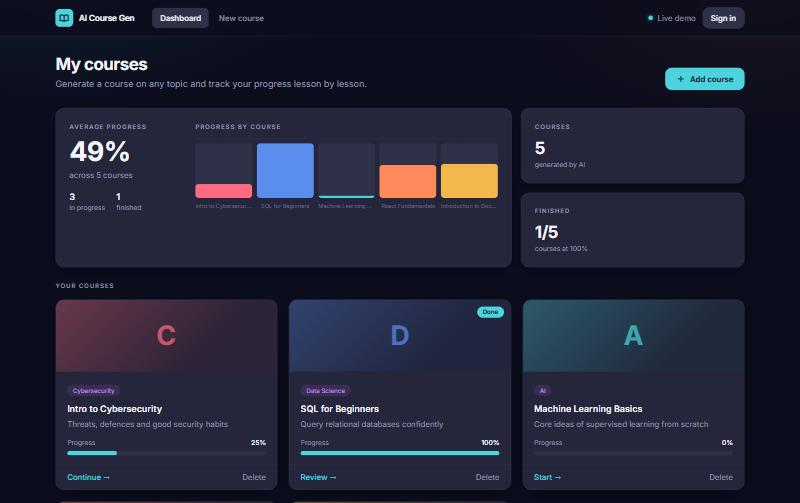
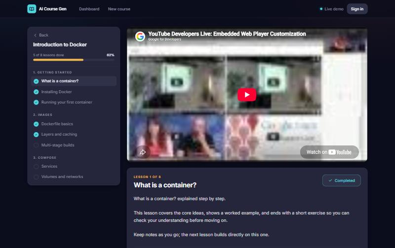

# AI Course Generator

Turn a topic into a structured, video-backed study course. The backend asks Google Gemini for a
module/lesson outline, resolves a YouTube video for every lesson, stores the course in MongoDB,
and the React app lets you work through it and track progress.

**Live demo:** https://ai-course-generator-wine.vercel.app
The API runs on a free-tier host that sleeps when idle, so the first request after a quiet period can take
30–60 seconds. The app shows a "waking up" screen while it connects.




> Honest scope note: this is a portfolio project about integrating two slow, quota-limited external APIs
> reliably (caching, concurrency, retries, throttling, tests, CI, containers). It is not trying to out-do
> asking a chat assistant for study notes; the extras are persistence, per-lesson progress and real embedded videos.

---

## Architecture

```
React (Vite, Tailwind)  ──HTTP/JSON──▶  Django REST Framework (Gunicorn)
                                          │
              ┌───────────────────────────┼───────────────────────────┐
              ▼                           ▼                           ▼
        MongoDB (MongoEngine)        Redis cache                External APIs
        courses → modules →          youtube:<term> → URL        Gemini (outline)
        subtopics (+progress)        gemini:<sha256> → outline   YouTube Data API (video per lesson)
        SQLite (Django ORM): users
```

**Generate a course** (`POST /api/courses/create/`, `courses/views.py`)
1. Throttle check (per client IP and global; fails open if Redis is down).
2. `gemini_service.generate_course` → Redis cache by normalised title/description/category (7 days);
   on a miss, one Gemini call with a hard 90 s budget, retries on transient errors or malformed JSON, and fallback to
   the next configured model when a model is over its daily quota. If every model is out of quota the API returns 503
   with a clear message.
3. `resolve_videos` looks up each distinct `search:<term>` on YouTube **concurrently** (8 workers),
   using the Redis cache (30 days) and retries with backoff (`utils/youtube_service.py`).
4. The course is saved to MongoDB and returned.

**Health.** `/ping/` is dependency-free (used to wake the free-tier host). `/health/` pings MongoDB and returns 503 if it is down.
MongoDB connects lazily on the first `/api/` request and retries every 5 s, so a paused Atlas cluster no longer needs a restart.

**Retrieve / progress** (`GET /api/courses/`, `GET /api/courses/<id>/`, `POST .../toggle/`, `POST .../progress/`)
read and update the course document; completion percentage is computed from the lessons marked done.

**Identity (known limitation).** Course endpoints are scoped by an `X-Demo-User` header (a random id the browser
generates), not by the JWT. JWT register/login/refresh/logout work and are tested, but a logged-in user's courses
are not yet tied to their account, and the header is client-supplied. Treat it as demo-grade isolation.

| Layer | Tech |
|---|---|
| Frontend | React 18, Vite, Tailwind, Axios |
| Backend | Django 4.2, DRF, SimpleJWT, Gunicorn |
| Data | MongoDB (courses), SQLite (users), Redis (cache + throttle counters) |
| AI / APIs | Google Gemini, YouTube Data API v3 |
| Tooling | Docker (multi-stage), GitHub Actions, pytest, Vitest |

---

## Quick start (Docker)

Prerequisites: Docker, a Gemini API key, a YouTube Data API key.

```bash
cp backend/.env.example backend/.env      # then fill in GEMINI_API_KEY and YOUTUBE_API_KEY
# docker compose reads keys from your shell environment (or a root .env file):
export GEMINI_API_KEY=... YOUTUBE_API_KEY=...
docker compose up --build                 # backend :8000, MongoDB and Redis included
```

Then run the frontend:

```bash
cd frontend
npm install
npm run dev                               # http://localhost:5173 (talks to http://localhost:8000)
```

Set `VITE_API_URL` in `frontend/.env` if the API is elsewhere.

### Without Docker

```bash
cd backend
python -m venv .venv && source .venv/bin/activate     # Windows: .venv\Scripts\activate
pip install -r requirements.txt
cp .env.example .env                                  # MONGODB_URI, REDIS_URL, API keys
python manage.py migrate
python manage.py runserver
```

### Environment variables

| Variable | Purpose | Default |
|---|---|---|
| `GEMINI_API_KEY`, `YOUTUBE_API_KEY` | API credentials (never commit) | – |
| `GEMINI_MODEL` | Primary Gemini model (models get retired; change here) | `gemini-3.5-flash` |
| `GEMINI_FALLBACK_MODELS` | Comma-separated models tried when the primary hits its daily quota or stays overloaded (free-tier quota is per model) | `gemini-3.8-flash,gemini-3.7-flash` |
| `MONGODB_URI` | MongoDB connection string | compose: local `mongo` service |
| `REDIS_URL` | Redis for caches and throttle counters (optional; app works without it) | `redis://…:6379/0` |
| `SECRET_KEY` | Django secret | insecure dev value; **set in production** |
| `DEBUG` | `True` enables `/admin/` and tracebacks | `False` |
| `NUM_PROXIES` | Reverse proxies in front of the app (Render: `1`) so throttling sees real client IPs | `0` |
| `GENERATE_RATE_IP`, `GENERATE_RATE_GLOBAL` | Generation limits | `10/hour`, `60/day` |
| `FRONTEND_URL` | CORS origin | `http://localhost:5173` |

**Quota warning.** One uncached course costs ~25–30 YouTube searches at 100 quota units each, so the default
10,000 units/day covers only a handful of fresh courses. Caching and the throttle exist for this reason.

---

## Tests, CI and benchmarks

```bash
# backend (Gemini/YouTube mocked, mongomock, fakeredis): no services or keys needed
cd backend && pip install -r requirements-dev.txt && pytest

# frontend
cd frontend && npm run lint && npm run test:coverage && npm run build
```

GitHub Actions (`.github/workflows/ci.yml`) runs backend tests, frontend lint/test/build and a Docker build on every push.

Benchmarks and the evidence behind every number are in [`docs/BENCHMARKS.md`](docs/BENCHMARKS.md) and
[`docs/RESUME_EVIDENCE.md`](docs/RESUME_EVIDENCE.md); raw outputs are under `docs/evidence/`.

```bash
cd backend
python -m bench.bench_generation --out ../docs/evidence/mine/gen.json   # simulated APIs, ~6 min
python -m bench.bench_resilience --out ../docs/evidence/mine/res.json   # simulated failures
python -m bench.bench_real --gemini-runs 3 --yt-cap 30 --out ../docs/evidence/mine/real.json   # REAL APIs, uses quota
bash bench/docker_measure.sh HEAD docs/evidence/mine/docker.txt         # image size / build time
```

---

## Roadmap / known gaps

- Tie courses to the authenticated user instead of the `X-Demo-User` header.
- Concurrent lesson toggles save the whole course document and can overwrite each other (use targeted Mongo updates).
- Move generation to a background task queue; it currently blocks a worker for up to ~90 s in the worst case.
- Course list pagination and a compound `(user_id, -created_at)` index (not measured yet).
- Frontend tests mock the API layer; there are no browser end-to-end tests.

MIT License.
